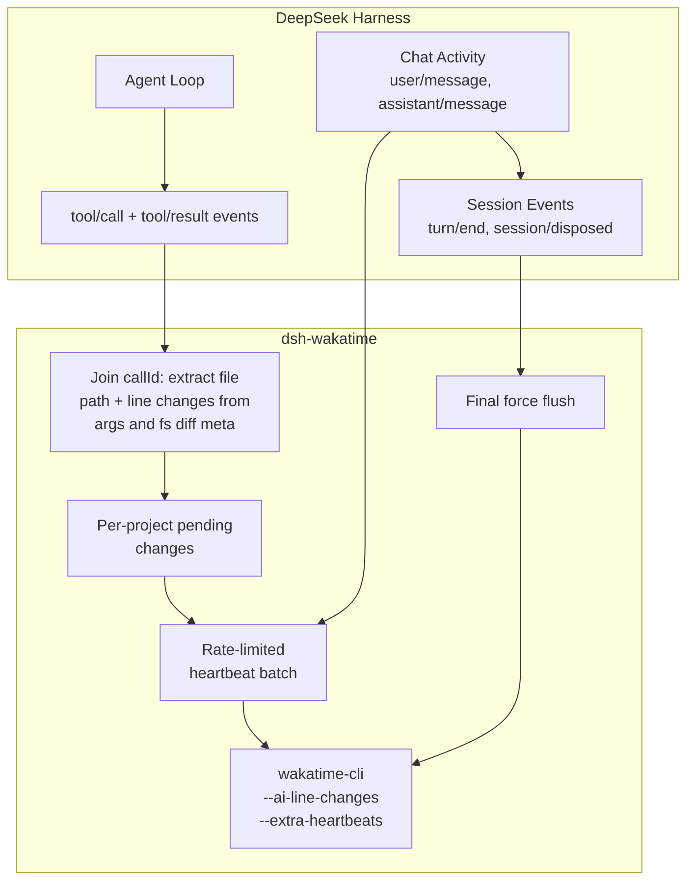

# @dingyi222666/dsh-wakatime

[](https://www.npmjs.com/package/@dingyi222666/dsh-wakatime)
[](https://github.com/dingyi222666/dsh-wakatime)

English | [中文](README.zh.md)

WakaTime plugin for [DeepSeek Harness (dsh)](https://github.com/deepseek-ai/deepseek-harness) — track your AI coding activity, lines of code, and time spent. Adapted from [opencode-wakatime](https://github.com/angristan/opencode-wakatime) to dsh's plugin model.

## Install

```sh
# Install from npm (requires dsh >= 0.1.0-rc.6)
dsh plugin --profile web add @dingyi222666/dsh-wakatime
# Restart dsh web for it to take effect
dsh web
```

The plugin works in any profile that runs the agent loop — `web`, `headless`, `tui`, … — install it into each profile you use:

```sh
dsh plugin --profile headless add @dingyi222666/dsh-wakatime
```

### From source (GitHub)

```sh
git clone https://github.com/dingyi222666/dsh-wakatime
cd dsh-wakatime
pnpm install && pnpm run build
dsh plugin --profile web add .
dsh web
```

Notes:

- `dsh plugin` behaves like adding a dependency to your profile. A bundle plugin is loaded once its full package name appears in the profile's `dsh.profile.bundles` list (added automatically); the bundle patch (`cordis.patch.yml`) applies on the next boot.
- To update, run the same command again.
- With the repo source-launched CLI, run the args through the bin directly (`node --import tsx/esm apps/cli/src/bin.ts plugin --profile web add @dingyi222666/dsh-wakatime`).

### Configuration

The plugin works out of the box. To override behavior, add a row with the
same id (`wakatime`) in your profile's user patch layer
(`$DSH_HOME/profiles/<name>/cordis.patch.yml`) or via `--patch`:

```yaml
- id: wakatime
  config:
    heartbeatIntervalMs: 120000  # rate limit per project (default 60000)
    debug: true                  # force DEBUG logging (default: ~/.wakatime.cfg debug=true)
    client: web                  # client tag in the --plugin string (default "dsh")
    timeoutMs: 45000             # heartbeat CLI timeout (default 30000)
```

All fields are optional and validated by a schemastery schema at load.

## Features

- **Automatic CLI management** — downloads and updates `wakatime-cli` automatically, or uses a global install (`brew install wakatime-cli`)
- **Detailed file tracking** — tracks file operations the agent performs: `edit`, `write`, `read`, and `str_replace_editor` (`view`/`create`/`str_replace`/`insert`)
- **AI coding metrics** — sends `--ai-line-changes` for WakaTime's AI coding analytics, computed exactly from the fs tools' diff hunks (context lines excluded)
- **Rate-limited heartbeats** — 1 per minute per project, persisted to disk so parallel dsh processes share the budget
- **Session lifecycle** — force-flushes pending heartbeats when a session is disposed and when the plugin tree tears down, so one-shot `dsh --profile headless` runs still report their activity
- **Batch tool support** — multiple files in one edit are sent in a single `wakatime-cli` invocation via `--extra-heartbeats`
- **Zero runtime dependencies** — the built plugin imports only Node builtins plus the `@deepseek-ai/*` peers the host already provides

## Prerequisites

### WakaTime API Key

Ensure you have a WakaTime API key configured in `~/.wakatime.cfg`
(or `$WAKATIME_HOME/.wakatime.cfg` when `WAKATIME_HOME` is set):

```ini
[settings]
api_key = waka_your_api_key_here
```

Get your API key from [WakaTime Settings](https://wakatime.com/api-key).

### WakaTime CLI (Optional)

The plugin downloads `wakatime-cli` automatically when missing. To install it yourself:

```bash
brew install wakatime-cli
```

or download from [WakaTime releases](https://github.com/wakatime/wakatime-cli/releases/latest).

## How It Works

The plugin subscribes to dsh's session event firehose (`session/event`):



- `tool/call` records the tool name and parsed arguments by `callId`; `tool/result`
  matches it back and reads the fs tools' private `meta` diff hunks for exact
  per-hunk line counts (`edit`, `write`), or derives them from the arguments
  (`write` content, `str_replace_editor` strings).
- Heartbeats are sent at most once per minute per project (state file under
  `~/.wakatime/dsh-wakatime/`), on chat activity, turn boundaries, session
  disposal, and plugin teardown.
- The `--plugin` tag reports `dsh-<client>/<dsh version> dsh-wakatime/<version>`.

## Development

```sh
pnpm install
pnpm run typecheck   # tsc --noEmit
pnpm run build       # declarations into lib/types + tsdown bundle lib/index.js
pnpm test            # vitest: changes, state, heartbeat, plugin wiring
```

Layout:

- `src/index.ts` — plugin entry (`name` / `Config` / `apply`) and event wiring
- `src/config.ts` — schemastery `Config` schema, defaults, `--plugin` tag
- `src/changes.ts` — tool events → file changes, diff line counting
- `src/state.ts` — per-project rate limiting
- `src/heartbeat.ts` — `wakatime-cli` invocation, batching, flushing
- `src/cli.ts` — `wakatime-cli` discovery/download/update
- `src/paths.ts`, `src/logger.ts` — WakaTime paths and file logging
- `tests/` — unit tests plus an integration test that drives the plugin over a
  real cordis `Context`

## Known Limitations

- Tool calls executed inside sandboxed/remote filesystems are tracked by their
  model-visible `file_path` arguments; paths the sandbox resolves differently
  may land as project-relative entities.
- `bash` commands are not attributed to files (they can touch anything).
- The dsh host version in the `--plugin` tag is `unknown` when the
  `@deepseek-ai/dsh` package cannot be resolved from the plugin's location
  (e.g. an npm install without the dev dependency present).

## License

MIT — ported logic from [opencode-wakatime](https://github.com/angristan/opencode-wakatime) (MIT).
